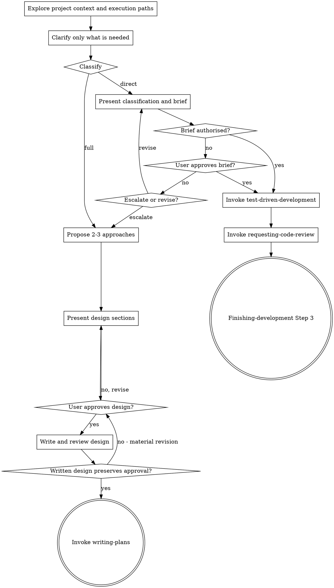

# Brainstorming implementation paths

## Overview

Explore and clarify a requested change, then route it by capacity. Work that is
one reviewable task, fits the current session, and has no unresolved
consequential design choice takes the direct path. Everything else keeps the
full design and planning path.

<HARD-GATE>
Full-path implementation needs design approval. Direct work needs an authorised
brief; the user's request can supply that authority.
</HARD-GATE>

## Anti-pattern: skipping the gate

Small work still needs classification and a four-field brief. Name the files
and verification before proceeding; investigate further if either is unclear.

## Checklist

Track these items in the current harness's task tracker and complete the
applicable branch in order:

1. **Explore project context** - check files, docs, recent changes, and representative existing execution paths
2. **Clarify only what is needed** - establish purpose, constraints, success criteria, task boundaries, and consequential design choices
3. **Classify** - evaluate both full-path triggers, the file diagnostic, and any user override
4. **Direct path** - present classification and brief; proceed if authorised
5. **Direct execution** - invoke `test-driven-development`, then mandatory `requesting-code-review`, then `finishing-development` at Step 3
6. **Full path** - compare approaches, present and approve the design, write and review it, then invoke `writing-plans`
7. **Upgrade when needed** - stop direct work that fires a trigger and re-enter at clarification

## Process flow



## Shared exploration and clarification

Check the current project state first: files, docs, recent changes, and
representative execution paths. Existing execution paths must come from
repository evidence. Continue exploring or label an assumption for user
approval; never invent a current call path.

Assess scope before detailed questions. If the request contains independent
subsystems, identify the pieces, their relationship, and their delivery order
before continuing. Ask one question at a time. Prefer open questions with two to
four concrete examples when examples help. Clarify only enough to establish the
purpose, constraints, success criteria, task boundaries, and consequential
design choices. Look up facts yourself; questions block only dependent work.

## Classification

The direct path is the default. Use the full path when any of these conditions
holds:

1. The work decomposes into more than one task that must land as separate
   commits.
2. More than one defensible approach remains, and the choice has consequences
   beyond this change.
3. The user explicitly requested a design or implementation plan.

Before choosing the direct path, name every affected file. Inability to do so is
evidence that one of the first two conditions has gone unnoticed. Continue
exploration or clarification until the trigger is named; the diagnostic does
not become a separate routing rule.

Report the decision in this form:

```text
Path: Direct | Full
Decomposes into separately committed tasks: yes | no
Open consequential design question: yes | no
File diagnostic: FilesNamed | CannotNameFiles
User design override: present | absent
Reason: <the fired trigger, or why none fired>
```

## Direct-path gate

Present the classification and brief in one message. The brief contains:

- **Changes:** the observable behaviour to add or alter.
- **Files:** every file to create, modify, or remove.
- **Verification:** the failing test, focused pass, and integrated check.
- **Exclusions:** adjacent work deliberately left unchanged.

The request authorises a brief within its scope. Ask for approval only for added
scope or a checkpoint the user requested. Revise the brief when corrected.

## Direct-path execution

Once the brief is authorised:

```text
1. test-driven-development
   EXECUTION_CONTEXT: main session
2. requesting-code-review
   JJ_BOUNDARY: @
   DESCRIPTION: direct-path implementation
   REQUIREMENTS: <inline the authorised brief verbatim>
   REVIEW_EXIT: fix and re-review Critical or Important findings until none remain
3. finishing-development
   Entry: Step 3
```

The authorised brief is the complete requirement boundary. Code review is
unconditional. `REQUIREMENTS` replaces `PLAN_REFERENCE`; a direct path has no
plan. Enter `finishing-development` at Step 3 because TDD plus the mandatory
review already supplied verification and review.

Keep these four facts in the task record; report only those useful to the user:

```text
Durable artefacts: code and tests
External docs repository: no design, plan, or brief file
VCS treatment: ad hoc under vcs.md
Commit authority: explicit user instruction required
```

## Upgrade from direct to full

If a full-path trigger emerges, preserve completed work, name the trigger and
return to clarification. Pause dependent implementation; continue independent
work. Do not revert edits without permission.

## Full path

### Compare approaches

Propose two or three approaches with their trade-offs. Lead with the recommended
option and explain why it best fits the clarified constraints. If the project is
too large for one design, decompose it and take the first sub-project through
this full path; each sub-project gets its own design, plan, and implementation
cycle.

### Present the design

Read `design-document-template.md` from this skill directory and use it as the
output contract. Scale sections to complexity. Approve the design together unless
an earlier decision determines later sections. Clarify unresolved assumptions.

Design units around one clear responsibility, explicit dependencies, and
interfaces consumers can understand without reading internals. Follow the
repository's existing patterns. Include targeted improvements only when an
existing problem blocks or materially complicates this work; avoid unrelated
refactoring.

### Write and review the design

Design and plan documents live in the external docs repository, separate from
the code repository. Resolve `$DOCS_ROOT` from the environment or the default in
the active instructions, then expand it to an absolute path. If neither source
defines it, ask the user. Never guess or write these documents in the code
repository.

Use these paths:

- Design: `$DOCS_ROOT/$projectName/designs/<slug>.md`
- Plan: `$DOCS_ROOT/$projectName/plans/<slug>.md`

Derive `$projectName` from the repository directory unless the user specifies a
different docs project. Use a user-provided slug, a suitable current jj bookmark
or change description, or ask for one. Create the design directory if needed.
VCS operations in `$DOCS_ROOT` remain the user's responsibility.

Before sharing the written design, self-review it for:

- completeness across purpose, constraints, success criteria, architecture,
  components, data flow, errors, testing, and programme design;
- internal consistency and focused scope;
- explicit assumptions and open questions;
- absence of placeholders and undefined references;
- conformance to `design-document-template.md`, including its programme-design
  and change-control checks;
- enough detail for a plan writer with no session history.

Fix any issue found by self-review. Then load `requesting-document-review` and
run it with `type=design` and no design reference. This review is mandatory.
Present the written design. Existing approval covers unchanged decisions; ask
for approval of material revisions. Apply corrections and repeat affected checks.

Once approved, invoke `writing-plans`. This is the full path's terminal state.

## Key principles

- **Capacity decides the path.** Perceived difficulty does not.
- **One question at a time.** Clarify only what affects routing or design.
- **Evidence before assumptions.** Establish current execution paths from the repository.
- **YAGNI.** Exclude work that does not serve the accepted outcome.
- **Full-path alternatives.** Compare two or three approaches when the full path fires.
- **Full-path validation.** Keep design sections explicit; approve decisions without repeated checkpoints.
