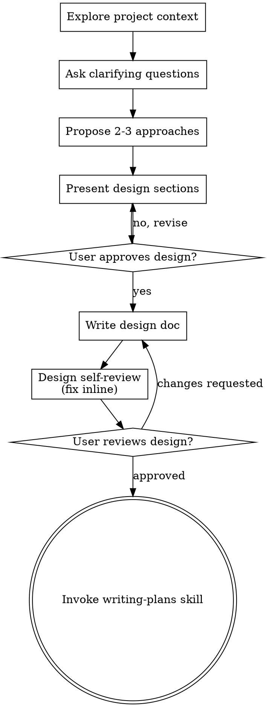

# Brainstorming Ideas Into Designs

## Overview

Help turn ideas into fully formed designs and specs through natural collaborative dialogue.

<HARD-GATE>
Do NOT invoke any implementation skill, write any code, scaffold any project, or take any implementation action until you have presented a design and the user has approved it.
</HARD-GATE>

**Announce at start:** "I'm using the brainstorming skill to refine your idea into a design."

Start by understanding the current project context, then ask questions one at a time to refine the idea. Once you understand what you're building, present the design in manageable sections, checking after each section whether it looks right so far.

## Anti-Pattern: "This Is Too Simple To Need A Design"

Every project goes through this process. A todo list, a single-function utility, a config change — all of them. "Simple" projects are where unexamined assumptions cause the most wasted work. The design can be short (a few sentences for truly simple projects), but you MUST present it and get approval.

## Checklist

You MUST track each of these items in the current harness's task tracker and complete them in order:

1. **Explore project context** — check files, docs, recent changes
2. **Ask clarifying questions** — one at a time, understand purpose/constraints/success criteria
3. **Propose 2-3 approaches** — with trade-offs and your recommendation
4. **Present design** — in sections scaled to their complexity, get user approval after each section
5. **Write design doc** — save to `$DOCS_ROOT/$projectName/designs/<slug>.md`
6. **Design self-review** — inline check for placeholders, contradictions, ambiguity, scope (see below)
7. **User reviews written design** — ask the user to review the design file before proceeding
8. **Transition to implementation** — invoke the writing-plans skill to create the implementation plan

## Process Flow

**The terminal state is invoking writing-plans.** Do NOT invoke frontend-design, mcp-builder, or any other implementation skill. The ONLY skill you invoke after brainstorming is writing-plans.

## The Process

**Understanding the idea:**
- Check out the current project state first (files, docs, recent changes)
- Before asking detailed questions, assess scope: if the request describes
  multiple independent subsystems, flag this immediately rather than refining
  details of a project that needs decomposition first.
- If the project is too large for a single spec, help the user decompose into
  sub-projects — the independent pieces, how they relate, what order to build —
  then brainstorm the first sub-project through the normal design flow. Each
  sub-project gets its own spec → plan → implementation cycle.
- Ask questions one at a time to refine the idea
- Prefer open-ended questions that include 2-4 concrete suggestions or examples to help the user respond
- Only one question per message - if a topic needs more exploration, break it into multiple questions
- Focus on understanding: purpose, constraints, success criteria, common gotchas and footguns

**Exploring approaches:**
- Propose 2-3 different approaches with trade-offs
- Present options conversationally with your recommendation and reasoning
- Lead with your recommended option and explain why

**Presenting the design:**
- Once you believe you understand what you're building, present the design
- Scale each section to its complexity: a few sentences if straightforward, up to 200-300 words if nuanced
- Ask after each section whether it looks right so far
- Cover: architecture, components, data flow, error handling, testing
- Be ready to go back and clarify if something doesn't make sense

**Design for isolation and clarity:**
- Break the system into smaller units that each have one clear purpose, communicate through well-defined interfaces, and can be understood and tested independently
- For each unit, you should be able to answer: what does it do, how do you use it, and what does it depend on?
- Can someone understand what a unit does without reading its internals? Can you change the internals without breaking consumers? If not, the boundaries need work.
- Smaller, well-bounded units are also easier for you to work with - you reason better about code you can hold in context at once, and your edits are more reliable when files are focused. When a file grows large, that's often a signal that it's doing too much.

**Working in existing codebases:**
- Explore the current structure before proposing changes. Follow existing patterns.
- Where existing code has problems that affect the work (e.g. a file that's grown too large, unclear boundaries, tangled responsibilities), include targeted improvements as part of the design - the way a good developer improves code they're working in.
- Don't propose unrelated refactoring. Stay focused on what serves the current goal.

## After the Design

**Documentation:**
- Design and plan documents always live in an external docs repo, separate from the code repo
- `$DOCS_ROOT` is the docs repo root. Use the `DOCS_ROOT` environment variable if set; otherwise default to `~/dev/j10t-docs`
- Designs: `$DOCS_ROOT/$projectName/designs/`
- Plans: `$DOCS_ROOT/$projectName/plans/`
- Determine `$projectName` from the repo directory name unless the user specifies a different docs project name
- Determine the document slug:
  - If the current jj bookmark or change description is a good semantic identifier, you may reuse its slug
  - Otherwise ask the user for a feature/design slug
- Design file: `$DOCS_ROOT/$projectName/designs/<slug>.md`
- Create the target directory if it doesn't exist
- Write the validated design to that filename
- VCS for the docs repo is the user's responsibility. Do not run jj/git commands in `$DOCS_ROOT` unless the user explicitly asks

**Design review (before sharing with user):**
Review the design yourself before sharing it.

**Inline self-review checklist:**
- **Completeness:** Purpose, constraints, success criteria, architecture, components, data flow, error handling, and testing are covered.
- **Internal consistency:** The design does not contradict itself across sections.
- **Scope control:** The design is focused enough for one implementation plan; unrelated subsystems are split out or marked as future work.
- **Ambiguity:** Open questions are explicit; assumptions are labelled.
- **No placeholders:** Remove `TBD`, `TODO`, vague component names, and undefined references.
- **Implementation readiness:** A plan writer can turn the design into concrete tasks without session history.

Fix any issues inline before sharing the design with the user. No need to re-review — just fix and move on.

**User Review Gate:**
After the self-review passes, ask the user to review the written design before proceeding:

> "Design written to `<path>`. Please review it and let me know if you want to make any changes before we start writing out the implementation plan."

Wait for the user's response. If they request changes, make them and re-run the self-review. Only proceed once the user approves.

**Implementation:**
- Invoke the writing-plans skill to create the detailed implementation plan
- Do NOT invoke any other skill. writing-plans is the next step.

## Key Principles

- **One question at a time** - Don't overwhelm with multiple questions in one message
- **Open-ended with concrete suggestions** - Give 2-4 examples or likely options to make answering easier
- **Incremental validation** - Present design in sections, validate each before continuing
- **YAGNI ruthlessly** - Remove unnecessary features from all designs
- **Explore alternatives** - Always propose 2-3 approaches before settling
- **Be flexible** - Go back and clarify when something doesn't make sense
