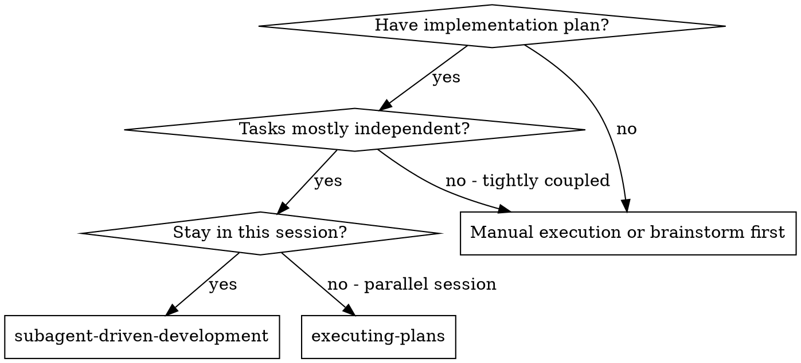
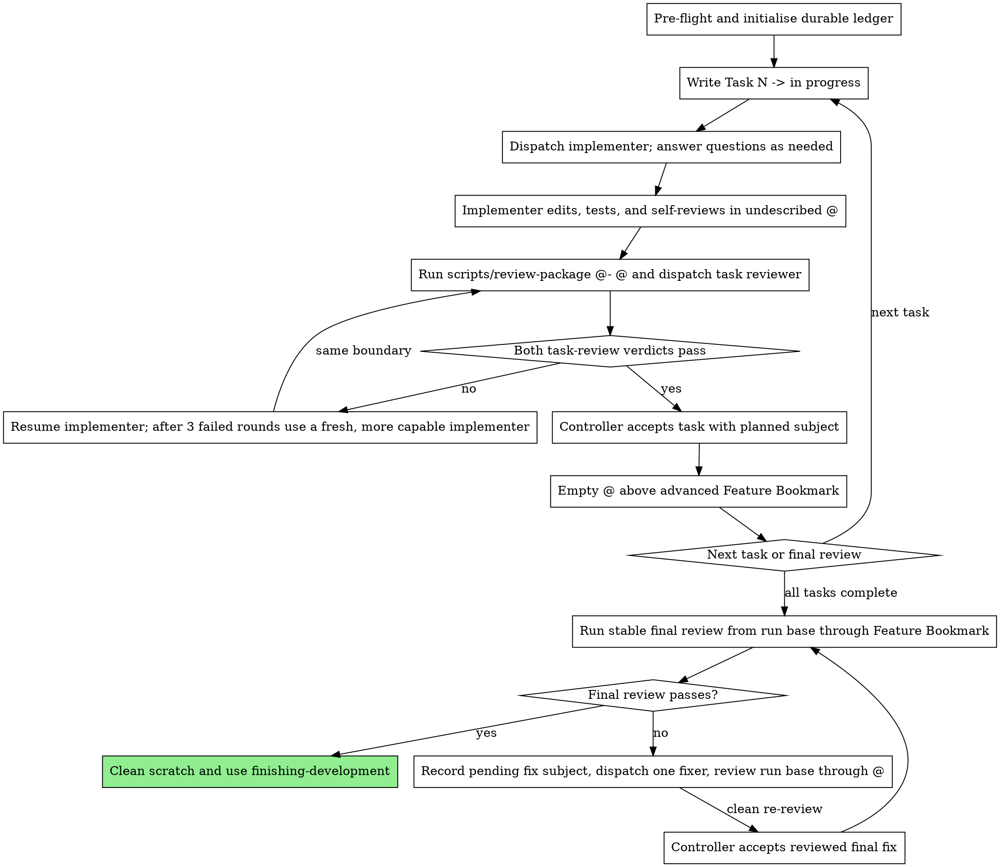

@../working-with-subagents/SKILL.md

# Subagent-Driven Development

Execute a plan by dispatching a fresh implementer subagent per task, a task review (spec compliance + code quality) after each, and a broad whole-branch review at the end.

**Why subagents:** You delegate tasks to specialised agents with isolated context. By precisely crafting their instructions and context, you keep them focused and set them up to succeed. They never inherit your session's context or history — you construct exactly what they need. This also preserves your own context for coordination work.

**Core principle:** Fresh subagent per task + task review (spec + quality) + broad final review = high quality, fast iteration

**Narration:** between tool calls, narrate at most one short line — the ledger and the tool results carry the record.

**Continuous execution:** Do not pause to check in between tasks. Execute all tasks from the plan without stopping. "Should I continue?" prompts and progress summaries waste the partner's time — they asked you to execute the plan, so execute it.

**Rulings, not stalls.** A running plan does not wait on a human. Conflicts, ambiguities, plan defects, a review finding that collides with the plan's text — decide them. The approved design is the binding authority, the plan is its argument from that design, and your judgement settles what neither answers. Record every decision in the ledger as a ruling and keep going. A wrong ruling costs rework the user can see and undo; a run parked on a question costs their whole session and buys nothing.

Five things stop the run, and only these:

- an irreversible or destructive operation
- a security-sensitive action
- an integration or side effect the user reserves — rebase, split, squash, amending an accepted commit, push, submit, PR work, or any bookmark movement beyond the declared feature bookmark
- ledger and repository state that no `Durable Progress` recovery row matches exactly
- a plan so broken that every path forward is a guess

Everything else is a ruling.

## When to Use



**vs. Executing Plans (parallel session):**
- Same session (no context switch)
- Fresh subagent per task (no context pollution)
- Review after each task (spec compliance + code quality), broad review at the end
- Faster iteration (no human-in-loop between tasks)

## The Process

> "Dispatch X subagent" below means delegate to a fresh agent via the current harness's subagent/delegation mechanism.

**SDD model requirement:** Every implementer, fixer, and task-reviewer dispatch explicitly supplies a model selected under `working-with-subagents`; these SDD calls use general-purpose delegation rather than matching preconfigured roles. Every final-review dispatch does the same. Resumed implementers retain their original model. The final whole-branch reviewer handles architecture and high-risk judgement, so use the most capable available model.



## Version Control

Exactly one implementation plan is active. The controller owns every VCS mutation; implementers and fixers edit and verify, and reviewers remain read-only. Formal-plan permission covers only creating the declared local feature bookmark and committing an accepted task or separately reviewed final fix. It does not grant ad-hoc or integration permission. Every non-empty undescribed task/fix `@` must have exactly one parent, and that parent must be the declared feature bookmark target.

| State | Required controller action |
|---|---|
| Run entry | Follow `Pre-Flight Plan Review`; matching existing state continues through `Durable Progress` |
| Task starts | Write `Task N -> in progress`; dispatch only after the ledger write succeeds |
| Task work | Keep non-empty `@` undescribed with the feature bookmark at `@-` |
| Task review | Run `scripts/review-package @- @`; fix and re-run the same boundary |
| Both task verdicts pass | Accept the task using its exact plan subject |
| Final review | Compare the recorded run-base commit with `Feature Bookmark` |
| Final fix starts | Record its exact pending `fix:` subject before dispatching the fixer |
| Final fix passes re-review | Accept the fix using its pending ledger subject |

### Accepting a Task or Final Fix

After the applicable verification/review gate:

1. Confirm `@` is non-empty, undescribed, has one parent, and that parent is the feature bookmark. Reconcile the completed ledger entries as one exact-subject, exact-parent path from the run base. Stop on any mismatch.
2. Read the task subject from its `**Commit:**` field, or the final-fix subject from its pending ledger entry.
3. Run `jj commit -m "<exact subject>"`. This leaves a new empty `@`; the accepted commit is `@-`.
4. Run `jj bookmark set "<Feature Bookmark>" -r @-`.
5. Read `@-` with `jj log -r @- --no-graph -T 'change_id ++ " " ++ commit_id'` and replace the pending ledger line with its full IDs and `(complete)`.

Never amend an accepted commit or improvise rollback, rebase, split, squash, amend, or any bookmark movement beyond the declared feature bookmark. If interruption leaves the commit, bookmark, and ledger out of step, use the recovery table below.

## Pre-Flight Plan Review

Run this once before Task 1 or when resuming an interrupted run:

1. Parse one `**Builds On:**`, one `**Feature Bookmark:**`, and one `**Commit:**` subject for every task; stop on missing or duplicate fields.
2. Resolve `Builds On` to one local bookmark target and record its full change and commit IDs as the immutable run base.
3. Read `.agents/sdd/progress.md`. A matching ledger resumes through `Durable Progress`; a ledger for another plan stops. Only an absent ledger is a fresh run.
4. On a fresh run, stop on unexplained non-empty `@`. Reuse empty `@` when its sole parent is the run base; otherwise run `jj new <Builds On>`.
5. On a fresh run, stop if `Feature Bookmark` already exists.
6. On a fresh run, write the ledger, then run `jj bookmark create <Feature Bookmark> -r <run-base-commit>`.
7. Resolve the plan's `**Design:**` path and read it. The design is the authority every ruling resolves against. If the plan names no design, or the path does not resolve, record `Ruling: proceeding with no reachable design -- <what you looked for> -- rulings in this run are provisional` and continue.

A fresh ledger starts with exactly this shape:

```text
plan: /absolute/path/to/plan.md
builds on: feature-a
feature bookmark: feature-b
run base: change aaaaaaaaaaaaaaaaaaaaaaaaaaaaaaaa, commit bbbbbbbbbbbbbbbbbbbbbbbbbbbbbbbbbbbbbbbb
```

These fixed-width IDs are synthetic format illustrations. Real entries come from `jj log -T 'change_id ++ " " ++ commit_id'` and must be full length.

### Plan Conflict Scan

Scan the plan once for conflicts before Task 1 dispatches, and write the result to the ledger as a table. The scan's output is rows, not a verdict:

- one row per pair of tasks sharing a file or an interface — the two tasks, what one produces against what the other consumes, and what you found
- one row per task — whether its own text agrees with itself: the tests it specifies against the code it specifies, the files it creates against the files it later touches
- one row per plan instruction the reviewer rubric treats as a defect — a test that asserts nothing, verbatim duplication of a logic block

"The scan is clean" without those rows is not a scan you ran.

Rule on every conflict the table surfaces before Task 1 dispatches — the design is the binding authority, the plan is its argument — and record each ruling beside its row. Carry a ruling into the dispatch of every task it binds. The review loop remains the net for conflicts that only emerge from implementation.

## Handling Implementer Status

Implementer subagents report one of four statuses. Handle each appropriately:

**DONE:** Generate the review package with `scripts/review-package @- @` from this skill's directory; it prints the file path it wrote. Then dispatch the task reviewer with that path.

**DONE_WITH_CONCERNS:** The implementer completed the work but flagged doubts. Read the concerns before proceeding. If they are about correctness or scope, address them before review. If they are observations (e.g. "this file is getting large"), note them and proceed to review.

**NEEDS_CONTEXT:** The implementer needs information that wasn't provided. Provide the missing context and re-dispatch.

**BLOCKED:** The implementer cannot complete the task. Assess the blocker:
1. If it's a context problem, provide more context and re-dispatch with the same model
2. If the task requires more reasoning, re-dispatch with a more capable model
3. If the task is too large, break it into smaller pieces
4. If the plan itself is wrong, rule on the correction, record the ruling, and re-dispatch with that ruling carried in the brief

**Never** ignore an escalation or force the same model to retry without changes. If the implementer said it's stuck, something needs to change.

## Handling Reviewer ⚠️ Items

The task reviewer may report "⚠️ Cannot verify from diff" items — requirements that live in unchanged code or span tasks. These do not block the rest of the review, but you must resolve each one yourself before accepting both task verdicts: you hold the plan and cross-task context the reviewer lacks. If you confirm an item is a real gap, treat it as a failed spec review — send it back to the implementer and re-review. Record how you resolved each item as a ruling.

## Fix Rounds

Resume the same implementer for Critical and Important review fixes. After three failed rounds, dispatch a fresh, more capable implementer. Re-review after every round.

## Constructing Reviewer Prompts

Per-task reviews are task-scoped gates. The broad review happens once, at the final whole-branch review. When you fill a reviewer template:

- Do not add open-ended directives like "check all uses" or "run race tests if useful" without a concrete, task-specific reason.
- Do not ask a reviewer to re-run tests the implementer already ran on the same code — the implementer's report carries the test evidence.
- Do not pre-judge findings for the reviewer — never instruct a reviewer to ignore or not flag a specific issue. If you believe a finding would be a false positive, let the reviewer raise it and adjudicate it in the review loop. If the prompt you are writing contains "do not flag," "don't treat X as a defect," "at most Minor," or "the plan chose" — stop: you are pre-judging, usually to spare yourself a review loop.
- The global-constraints block you hand the reviewer is its attention lens. Copy the binding requirements verbatim from the plan's Global Constraints section or the spec: exact values, exact formats, and the stated relationships between components ("same layout as X", "matches Y"). The reviewer's template already carries the process rules (YAGNI, test hygiene, review method) — the constraints block is for what THIS project's spec demands.
- Hand the reviewer its diff as a file: run this skill's `scripts/review-package @- @` and pass the reviewer the file path it prints. The output never enters your own context, and the reviewer sees the accepted parent plus the current task's undescribed working-copy change.
- A dispatch prompt describes one task, not the session's history. Do not paste accumulated prior-task summaries ("state after Tasks 1-3") into later dispatches. A fresh subagent needs its task, the interfaces it touches, and the global constraints. Nothing else.
- Record Minor findings in the task report and point the final whole-branch review at that list so it can triage which must be fixed before merge. A roll-up nobody reads is a silent discard.
- A finding labelled plan-mandated — or any finding that conflicts with what the plan's text requires — is yours to rule on: weigh the finding against the plan text, decide with the design as the binding authority, and record the ruling before you act on it. Do not dismiss the finding because the plan mandates it, and do not dispatch a fix that contradicts the plan without a recorded ruling.
- Final review packages use exact revisions appropriate to their state:
  - Stable final review: `scripts/review-package RUN_BASE FEATURE_BOOKMARK`
  - Pending final-fix re-review: `scripts/review-package RUN_BASE @`
  `RUN_BASE` is the full run-base commit ID recorded in the ledger.
- Every fix round carries the implementer contract: the implementer re-runs the tests covering its change and reports the results. Name the covering test files in the assignment — a one-line fix does not need the whole suite. Before re-dispatching the reviewer, confirm the fix report contains the covering tests, the command run, and the output.
- A final-review fixer follows the same VCS ban as an implementer. A `**Commit:**` line belongs to the controller, does not authorise VCS commands, and must be ignored while the fixer edits and verifies.
- If the final whole-branch review returns findings, append this exact durable entry before dispatching ONE fix subagent with the complete findings list:

  ```text
  Final review fix 1 -> pending (subject `fix: address final review findings`)
  ```

  After its run-base-through-`@` package receives a clean re-review, use `Accepting a Task or Final Fix`. Never amend a task commit.
- Scratch cleanup occurs only after final review passes and no pending fix exists. Remove `.agents/sdd/` then; another plan may start only after cleanup.

## File Handoffs

Everything you paste into a dispatch prompt — and everything a subagent prints back — stays resident in your context for the rest of the session and is re-read on every later turn. Hand artifacts over as files:

- **Task-scoped context boundary:** Every implementer, fixer, and task-reviewer dispatch must state that its supplied brief, context, and named artefacts are its complete boundary. The subagent must not locate the parent plan, neighbouring tasks, progress ledger, prior-task materials, or session history. Missing requirements are escalated to the controller rather than discovered by broadening scope. This restriction does not apply to the final whole-branch reviewer.
- **Task brief:** before dispatching an implementer, run this skill's `scripts/task-brief PLAN_FILE N` — it extracts the task's full text to a file and prints the path. Compose the dispatch so the brief stays the single source of requirements. Your dispatch should contain: (1) one line on where this task fits; (2) the brief path, introduced as "read this first — it is your requirements, with the exact values to use verbatim"; (3) interfaces and decisions from earlier tasks that the brief cannot know; (4) your resolution of any ambiguity you noticed in the brief; (5) the report-file path and report contract. Exact values (numbers, magic strings, signatures, test cases) appear only in the brief.
- **Report file:** name the implementer's report file after the brief (`…/task-N-brief.md` → `…/task-N-report.md`) and put it in the dispatch prompt. The implementer writes the full report there and returns only status, a one-line test summary, and concerns.
- **Reviewer inputs:** the task reviewer gets three paths — the same brief file, the report file, and the review package — plus the global constraints that bind the task.
- Fix rounds append their report (with test results) to the same report file and return a short summary; re-reviews read the updated file.

## Durable Progress

Conversation memory does not survive compaction. `.agents/sdd/progress.md` is the durable state; never infer completion from conversation history. Its exact record forms are:

```text
plan: /absolute/path/to/plan.md
builds on: feature-a
feature bookmark: feature-b
run base: change aaaaaaaaaaaaaaaaaaaaaaaaaaaaaaaa, commit bbbbbbbbbbbbbbbbbbbbbbbbbbbbbbbbbbbbbbbb

Task 1 -> in progress
Task 1 -> change cccccccccccccccccccccccccccccccc, commit dddddddddddddddddddddddddddddddddddddddd (complete)
Final review fix 1 -> pending (subject `fix: exact subject`)
Final review fix 1 -> change eeeeeeeeeeeeeeeeeeeeeeeeeeeeeeee, commit ffffffffffffffffffffffffffffffffffffffff (complete)
```

The numbered state lines are mutually exclusive format examples. Synthetic IDs only illustrate width; completed entries contain the real full change and commit IDs from jj.

Rulings are records, not state. Append each one where you make it, in exactly this form:

```text
Ruling: <what you decided> -- <why> -- <what it costs if wrong>
```

Reconciliation and recovery read only the `->` state lines; a ruling line never resolves to a change, a commit, or a task.

Legacy, stale, or foreign ledger formats have no migration or compatibility path: stop rather than guessing or converting.

Before any redispatch, prove:

- every completed ledger change ID and commit ID still resolve to the same snapshot;
- described commits after run base form one path in plan order;
- each recovered task has the exact plan subject and expected parent;
- completed task commits are never amended or redispatched.

After those checks, perform only the action in the first matching recovery row:

| Observed state | One recovery action |
|---|---|
| initialised ledger, absent feature bookmark, no task commits | Create the missing bookmark at run base. |
| next exact task commit present while bookmark and ledger are behind | Advance the bookmark, then record its full identities. |
| bookmark advanced while ledger still says in progress | Record the commit's full identities. |
| completed final-fix commit with bookmark or ledger behind | Advance the bookmark, then record its full identities. |
| pending final fix plus empty `@` and no matching child | Resume the recorded final-fix wave. |
| pending final fix plus non-empty undescribed `@` | Resume run-base-through-`@` re-review. |
| task in progress plus empty `@` | Dispatch or resume the recorded task. |
| task in progress plus non-empty undescribed `@` | Dispatch or resume the recorded task. |
| empty `@` above feature bookmark with no pending entry | Start the first uncompleted task or final review. |
| unexplained non-empty `@`, described active `@`, divergence, or identity mismatch | Ambiguous: stop and ask. |

Do not use `jj op log` as a substitute ledger and do not repair any state outside this table. If no row matches exactly, stop and ask.

## Finish

Before removing `.agents/sdd/`, collect every `Ruling:` line in the ledger — the conflict scan's, the ⚠️ resolutions, the plan-mandated findings, all of them — into your final message under "Rulings I made", in the order you made them, each with what it costs if wrong. The list is exhaustive: if the ledger holds a ruling, the list holds it. That list is the only place decisions you took on the user's behalf reach them, and it is what they read to find what needs reworking. A ruling deleted with the scratch directory was a decision made in secret.

Then hand off with finishing-development.

## Prompt Templates

- [implementer-prompt.md](implementer-prompt.md) - Dispatch implementer subagent
- [task-reviewer-prompt.md](task-reviewer-prompt.md) - Dispatch task reviewer subagent (spec compliance + code quality)
- Final whole-branch review: use requesting-code-review's [code-reviewer.md](../requesting-code-review/code-reviewer.md)

## Example Workflow

```
You: I'm using Subagent-Driven Development to execute this plan.

[Parse one Builds On, one Feature Bookmark, and every task Commit subject]
[Resolve and record the immutable run base; reconcile or initialise the ledger]
[Position empty @; create Feature Bookmark at run base only after the ledger write]

Task 1: Hook installation script

[Write "Task 1 -> in progress"; run task-brief; dispatch implementer]
Implementer: [Status: DONE; 5/5 passing; report at .../task-1-report.md]

[Run scripts/review-package @- @; dispatch task reviewer]
Task reviewer: Spec ✅. Task quality: Approved.

[Accept Task 1: commit with its exact plan subject, advance Feature Bookmark, record full identities]

Task 2: Recovery modes

[Write "Task 2 -> in progress"; dispatch implementer; report DONE]
[Run scripts/review-package @- @; dispatch task reviewer]
Task reviewer: Spec ❌. Task quality: Needs fixes.

[Resume the implementer; keep @ undescribed]
[Re-run scripts/review-package @- @; re-dispatch task reviewer]
Task reviewer: Spec ✅. Task quality: Approved.
[Accept Task 2 using `Accepting a Task or Final Fix`]

...

[Run scripts/review-package RUN_BASE FEATURE_BOOKMARK; dispatch final reviewer]
Final reviewer: Important findings.
[Append "Final review fix 1 -> pending (subject `fix: address final review findings`)" before fixer dispatch]
[Dispatch ONE final-review fixer; run scripts/review-package RUN_BASE @]
Final reviewer: Clean re-review.
[Accept the reviewed final fix with its pending subject]
[Repeat stable final review; after it passes with no pending fix, report every ledger Ruling: line under "Rulings I made", then remove .agents/sdd/]
```

## Advantages

**vs. Manual execution:**
- Subagents follow TDD naturally
- Fresh context per task (no confusion)
- Parallel-safe (subagents don't interfere)
- Subagent can ask questions (before AND during work)

**vs. Executing Plans:**
- Same session (no handoff)
- Continuous progress (no waiting)
- Review checkpoints automatic

**Efficiency gains:**
- Bulk artifacts move as files, not pasted text — the controller's context stays small
- Controller curates exactly what context each subagent needs
- Subagent gets complete information upfront
- Questions surfaced before work begins (not after)

**Quality gates:**
- Self-review catches issues before handoff
- Task review carries two verdicts: spec compliance and code quality
- Review loops ensure fixes actually work
- Spec compliance prevents over/under-building
- Code quality ensures implementation is well-built

**Cost:**
- More subagent invocations (implementer + reviewer per task)
- Controller does more prep work (briefs, packages)
- Review loops add iterations
- But catches issues early (cheaper than debugging later)

## Red Flags

**Never:**
- Build implementation work directly on the trunk bookmark (main/master) without explicit user consent — start a new change for the run
- Skip task review, or accept a report missing either verdict (spec compliance AND task quality are both required)
- Proceed with unfixed Critical/Important issues
- Dispatch multiple implementation subagents in parallel (conflicts)
- Make a subagent read the whole plan file (hand it its task brief — `scripts/task-brief` — instead)
- Let a task-scoped subagent locate or read the parent plan, neighbouring tasks, progress ledger, prior-task materials, or session history
- Skip scene-setting context (subagent needs to understand where the task fits)
- Ignore subagent questions (answer before letting them proceed)
- Accept "close enough" on spec compliance (reviewer found spec issues = not done)
- Skip review loops (reviewer found issues = implementer fixes = review again)
- Let implementer self-review replace actual review (both are needed)
- Tell a reviewer what not to flag, or pre-rate a finding's severity in the dispatch prompt ("treat it as Minor at most")
- Dispatch a task reviewer without a diff file — generate it first (`scripts/review-package @- @`) and name the printed path in the prompt
- Move to the next task while the review has open Critical/Important issues
- Re-dispatch a task the progress ledger already marks complete — reconcile the ledger and committed path after any compaction or resume
- Let a subagent run jj or git commands — every VCS mutation belongs to the controller
- Park the run on a question the design, the plan, or your own judgement can answer — rule, record it, carry on
- Remove `.agents/sdd/` before every ruling in it has been reported to the user

**If subagent asks questions:**
- Answer clearly and completely
- Provide additional context if needed
- Don't rush them into implementation

**If subagent fails task:**
- Dispatch a fix subagent with specific instructions
- Don't try to fix it manually (context pollution)

## Integration

**Required workflow skills:**
- **writing-plans** - Creates the plan this skill executes (its Global Constraints feed the reviewer's attention lens)
- **requesting-code-review** - Code review template for the final whole-branch review
- **finishing-development** - Complete development after all tasks

**Subagents should use:**
- **test-driven-development** - Subagents follow TDD for each task

**Alternative workflow:**
- **executing-plans** - Use for inline execution without task subagents
