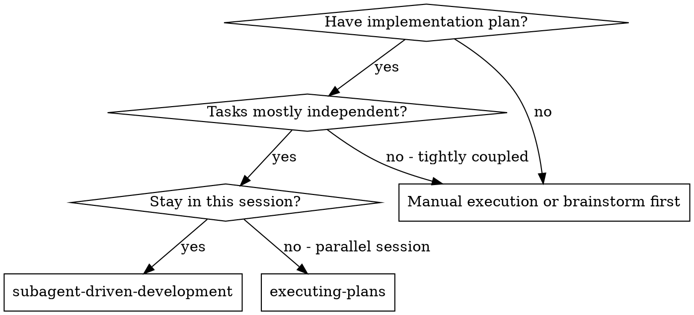
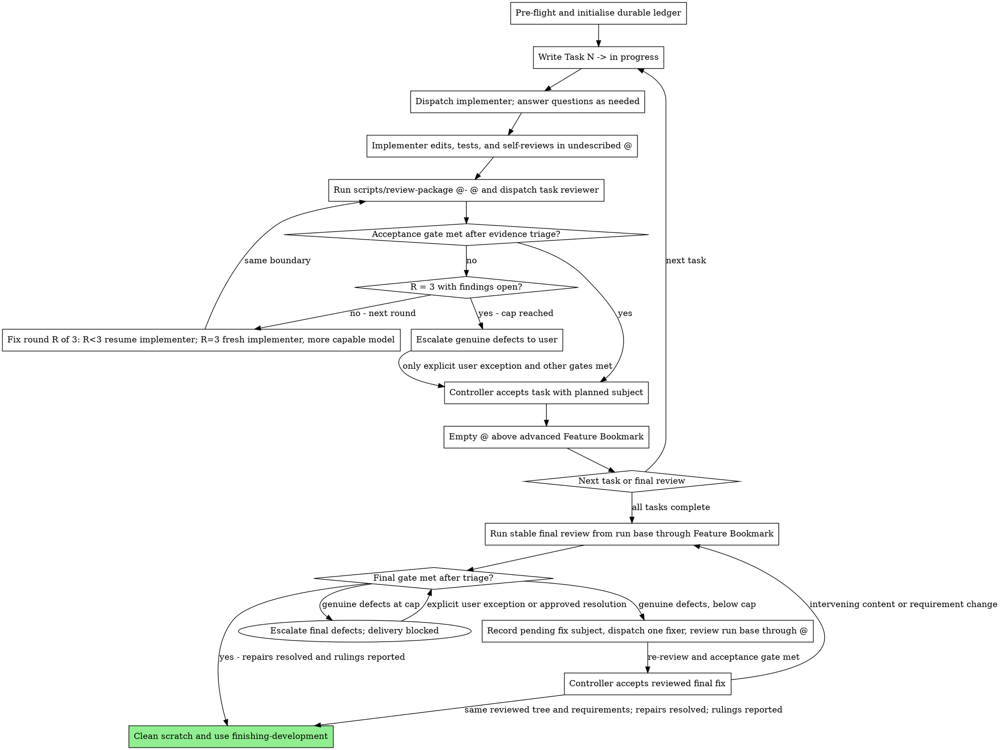

@../working-with-subagents/SKILL.md

# Subagent-Driven Development

Execute a plan by dispatching a fresh implementer subagent per task, a task review (spec compliance + code quality) after each, and a broad whole-branch review at the end.

**Why subagents:** You delegate tasks to specialised agents with isolated context. By precisely crafting their instructions and context, you keep them focused and set them up to succeed. They never inherit your session's context or history — you construct exactly what they need. This also preserves your own context for coordination work.

**Core principle:** Fresh subagent per task + task review (spec + quality) + broad final review = high quality, fast iteration

**Narration:** between tool calls, narrate at most one short line — the ledger and the tool results carry the record.

**Continuous execution:** Execute authorised tasks without routine continuation prompts. Pause affected work for missing requirements or authority; progress does not justify expanding scope.

The approved design is the source of truth. Correct routine plan errors against it; ask the user before adding behaviour or architectural machinery. Keep execution rulings in scratch storage, not in the design or plan. Follow `using-skills` for user precedence and pause diagnostics.

Pause affected work for these conditions; continue independent authorised work:

- an irreversible or destructive operation
- a security-sensitive action
- an integration or side effect the user reserves, meaning rebase, split, squash, amending an accepted commit, push, submit, PR work, or any bookmark movement beyond the declared feature bookmark
- ledger and repository state that no `recovery.md` row matches exactly
- a genuine Critical/Important defect remaining after three fix rounds without an explicit user exception
- a plan so broken that every path forward is a guess
- a consequential choice not settled by the approved requirements

Resolve routine matters with evidence-backed rulings. A ruling cannot defer a genuine Critical/Important defect into acceptance.

Load [recovery.md](recovery.md) on resume, interruption or unexplained state. Load [review-handling.md](review-handling.md) for findings, unverifiable requirements or implementer escalation, including apparently unrelated failures. Ordinary execution needs neither reference immediately.

**Controller validation:** Before task acceptance, inspect the actual diff for correctness, requested scope, unexpected paths and unnecessary complexity. Before delivery, read the resulting implementation across the affected execution paths and validate it against the approved design. Reviewer verdicts and passing tests support this judgement; they do not replace it.

**Acceptance gate:** Obtain independent task review with both spec-compliance and quality verdicts. Accept only when applicable checks pass, every unverifiable requirement is resolved, and blocking findings are resolved by passing review after genuine fixes, evidence-backed rejection of factually false findings, or an explicit user exception. A false finding needs no replacement passing verdict and consumes no fix round. Genuine Critical/Important defects require fixes and re-review; after three fix rounds, escalate rather than accept by controller deferral. Record Minor findings for final triage. Combined repairs require checks and review covering both original and repair requirements. Final delivery also requires resolution of separately managed failures unless the user explicitly changes that requirement.

## When to Use



**vs. Executing Plans (parallel session):**
- Same session (no context switch)
- Fresh subagent per task (no context pollution)
- Review after each task (spec compliance + code quality), broad review at the end
- Faster iteration (no human-in-loop between tasks)

## The Process

> "Dispatch X subagent" below means delegate to a fresh agent via the current harness's subagent/delegation mechanism.

**SDD model requirement:** Every implementer, fixer, and task-reviewer dispatch explicitly supplies a model selected under `working-with-subagents`; these SDD calls use general-purpose delegation rather than matching preconfigured roles. Every final-review dispatch does the same. If the harness exposes only a known inherited model, record and use inheritance instead of inventing an explicit model ID. Resumed implementers retain their original model. The final whole-branch reviewer handles architecture and high-risk judgement, so use the most capable available model.



## Version Control

Exactly one implementation plan is active. The controller owns every VCS mutation; implementers and fixers edit and verify, and reviewers remain read-only. Formal-plan permission covers only creating the declared local feature bookmark and committing an accepted task or separately reviewed final fix. It does not grant ad-hoc or integration permission. Every non-empty undescribed task/fix `@` must have exactly one parent, and that parent must be the declared feature bookmark target.

| State | Required controller action |
|---|---|
| Run entry | Follow `Pre-Flight Plan Review`; matching existing state continues through `Durable Progress` |
| Task starts | Write `Task N -> in progress`; dispatch only after the ledger write succeeds |
| Task work | Keep non-empty `@` undescribed with the feature bookmark at `@-` |
| Task review | Run `scripts/review-package @- @`; triage findings, fix genuine defects and re-review the same boundary |
| Acceptance gate met after both verdicts | Accept using the exact plan subject, amended prospectively for a combined repair |
| Final review | Compare the recorded run-base commit with `Feature Bookmark` |
| Final fix starts | Record its exact pending `fix:` subject before dispatching the fixer |
| Final fix re-reviewed and gate met | Accept the fix using its pending ledger subject |

### Accepting a Task or Final Fix

After the acceptance gate above, including both scopes for a combined repair and the applicable final review for a final fix:

1. Complete controller validation. Confirm the exact changed paths belong to the approved task or repair and contain no scratch reports, review history or logs. Confirm `@` is non-empty, undescribed, has one parent, and that parent is the feature bookmark. Reconcile the completed ledger entries as one exact-subject, exact-parent path from the run base. Stop on any mismatch.
2. Read the task subject from its `**Commit:**` field, or the final-fix subject from its pending ledger entry.
3. Run `jj commit -m "<exact subject>"`. This leaves a new empty `@`; the accepted commit is `@-`.
4. Run `jj bookmark set "<Feature Bookmark>" -r @-`.
5. Read `@-` with `jj log -r @- --no-graph -T 'change_id ++ " " ++ commit_id'` and replace the pending ledger line with its full IDs and `(complete)`.

Never amend an accepted commit or improvise rollback, rebase, split, squash, amend, or any bookmark movement beyond the declared feature bookmark. If interruption leaves the commit, bookmark, and ledger out of step, load `recovery.md`.

## Pre-Flight Plan Review

Run this once before Task 1 or when resuming an interrupted run:

1. Parse one `**Builds On:**`, one `**Feature Bookmark:**`, and one `**Commit:**` subject for every task; stop on missing or duplicate fields.
2. Resolve `Builds On` to one local bookmark target and record its full change and commit IDs as the immutable run base.
3. Read `.agents/sdd/progress.md`. A matching ledger resumes through `Durable Progress`; a ledger for another plan stops. Only an absent ledger is a fresh run.
4. On a fresh run, stop on unexplained non-empty `@`. Reuse empty `@` when its sole parent is the run base; otherwise run `jj new <Builds On>`.
5. On a fresh run, stop if `Feature Bookmark` already exists.
6. On a fresh run, initialise ignored scratch with `scripts/sdd-workspace`, write the ledger, then run `jj bookmark create <Feature Bookmark> -r <run-base-commit>`.
7. Resolve the plan's `**Design:**` path and read the approved design. If it is missing or unreachable, stop and ask; do not make provisional design decisions.
8. Establish the required-check baseline under `verification-before-completion` before source edits. Record the revision, commands, exit statuses and concise results in ignored scratch storage. On resume, reuse applicable baseline evidence and distinguish it from post-edit verification.

A fresh ledger starts with exactly this shape:

```text
plan: /absolute/path/to/plan.md
builds on: feature-a
feature bookmark: feature-b
run base: change aaaaaaaaaaaaaaaaaaaaaaaaaaaaaaaa, commit bbbbbbbbbbbbbbbbbbbbbbbbbbbbbbbbbbbbbbbb
```

These fixed-width IDs are synthetic format illustrations. Real entries come from `jj log -T 'change_id ++ " " ++ commit_id'` and must be full length.

### Plan Conflict Scan

Scan the plan once for conflicts before Task 1 dispatches, and write the result to the ledger as a table. The scan produces rows, not a verdict.

- one row per pair of tasks sharing a file or an interface, naming the two tasks, what one produces against what the other consumes, and what you found
- one row per task, checking supplied production/test code against behaviour, interfaces, cases and side effects; missing bodies or integration decisions block dispatch
- one row per plan instruction the reviewer rubric treats as a defect, such as a test that asserts nothing or verbatim duplication of a logic block

Check that code steps are complete and producer/consumer signatures agree. Allow
local syntax or naming adjustments, not unspecified implementation structure.
Additional behaviour, dependencies or architectural machinery require approval.

"The scan is clean" without those rows is not a scan you ran.

Rule on every conflict the table surfaces before Task 1 dispatches. The design is the binding authority and the plan is its argument. Record each ruling beside its row, and carry a ruling into the dispatch of every task it binds. The review loop still catches conflicts that only emerge from implementation.

## Handling Implementer Status

Implementer subagents report one of four statuses. Handle each appropriately:

**DONE:** Generate the review package with `scripts/review-package @- @` from this skill's directory; it prints the file path it wrote. Then dispatch the task reviewer with that path.

**DONE_WITH_CONCERNS:** The implementer completed the work but flagged doubts. Read the concerns before proceeding. If they are about correctness or scope, address them before review. If they are observations (e.g. "this file is getting large"), note them and proceed to review.

For **NEEDS_CONTEXT**, **BLOCKED**, or an apparently unrelated failure, load [review-handling.md](review-handling.md) before disposition. Continue only independent authorised work.

## Constructing Reviewer Prompts

Per-task reviews are task-scoped gates. The broad review happens once, at the final whole-branch review. When you fill a reviewer template:

- Do not add open-ended directives like "check all uses" or "run race tests if useful" without a concrete, task-specific reason.
- Do not ask a reviewer to re-run tests the implementer already ran on the same code — the implementer's report carries the test evidence.
- Do not pre-judge findings for the reviewer — never instruct a reviewer to ignore or not flag a specific issue. If you believe a finding would be a false positive, let the reviewer raise it and adjudicate it in the review loop. If the prompt you are writing contains "do not flag," "don't treat X as a defect," "at most Minor," or "the plan chose" — stop: you are pre-judging, usually to spare yourself a review loop.
- The global-constraints block you hand the reviewer is its attention lens. Copy the binding requirements verbatim from the plan's Global Constraints section or the spec: exact values, exact formats, and the stated relationships between components ("same layout as X", "matches Y"). The reviewer's template already carries the process rules (YAGNI, test hygiene, review method) — the constraints block is for what THIS project's spec demands.
- Generate `scripts/review-package @- @`, inspect its diff yourself, then pass the same file to the reviewer. It covers the accepted parent through the current task.
- A dispatch prompt describes one task, not the session's history. Do not paste accumulated prior-task summaries ("state after Tasks 1-3") into later dispatches. A fresh subagent needs its task, the interfaces it touches, and the global constraints. Nothing else.
- Record Minor findings in the task report and point the final whole-branch review at that list so it can triage which must be fixed before merge. A roll-up nobody reads is a silent discard.
- A finding labelled plan-mandated — or any finding that conflicts with what the plan's text requires — is yours to rule on: weigh the finding against the plan text, decide with the design as the binding authority, and record the ruling before you act on it. Do not dismiss the finding because the plan mandates it, and do not dispatch a fix that contradicts the plan without a recorded ruling.
- Final review packages use exact revisions appropriate to their state:
  - Stable final review: `scripts/review-package RUN_BASE FEATURE_BOOKMARK`
  - Pending final-fix re-review: `scripts/review-package RUN_BASE @`
  `RUN_BASE` is the full run-base commit ID recorded in the ledger.
- Every fix round carries the implementer contract: the implementer re-runs the tests covering its change and reports the results. Name the covering test files in the assignment — a one-line fix does not need the whole suite. Before re-dispatching the reviewer, confirm the fix report contains the covering tests, the command run, and the output.
- A final-review fixer follows the same VCS ban as an implementer. A `**Commit:**` line belongs to the controller, does not authorise VCS commands, and must be ignored while the fixer edits and verifies.
- If the final whole-branch review returns findings, load `review-handling.md` and triage first. If fixes remain, append this exact durable entry before dispatching ONE fix subagent with the complete unresolved findings list:

  ```text
  Final review fix 1 -> pending (subject `fix: address final review findings`)
  ```

  Track final-review fix rounds in the fix report without changing ledger forms; three rounds is also the cap for those findings. After its run-base-through-`@` package receives re-review and the acceptance gate is met, use root `SKILL.md`, `Accepting a Task or Final Fix`. Confirm acceptance preserved the reviewed tree and requirements; reuse that review rather than repeating it solely because commit metadata changed. Never amend a task commit.
- Final review receives original rejected findings, their evidence-backed rulings, Minor findings and every repair work item. It may reassess them independently.
- Remove scratch after final validation and delivery, once consequential decisions and explicit user-accepted limitations have been reported. Preserve other unresolved work. Another plan may start only after cleanup.

## File Handoffs

Use ignored `.agents/sdd/` scratch files for task context and execution evidence.
Initialise it through `scripts/sdd-workspace` before writing the ledger or reports.
Keep approved designs and plans in the external docs repository after delivery;
never append review commentary or archive execution material there.

- **Task-scoped context boundary:** Every implementer, fixer, and task-reviewer dispatch must state that its supplied brief, context, and named artefacts are its complete boundary. The subagent must not locate the parent plan, neighbouring tasks, progress ledger, prior-task materials, or session history. Missing requirements are escalated to the controller rather than discovered by broadening scope. This restriction does not apply to the final whole-branch reviewer.
- **Task brief:** run `scripts/task-brief PLAN_FILE N`. It includes the common plan preamble and the selected task, preserving global constraints, shared contracts, required context and complete production/test code. Read the generated brief and check that it contains every requirement the task needs before dispatch. Keep common requirements before the first task in the plan. Add only necessary earlier-task interface facts and resolved operative corrections; never accumulated review history.
- **Assignment:** state scope, writable paths, necessary tools, exclusions and the report path. Further delegation requires controller permission. A design/plan reference in the preamble identifies controller authority, not permission for a task-scoped agent to read it.
- **Baseline evidence:** every implementer, fixer and reviewer gets the applicable pre-edit revision, commands, exit statuses and concise results, as an excerpt or an explicitly named ignored scratch file. Do not require ledger access or substitute post-edit results.
- **Report file:** name the implementer's report file after the brief (`…/task-N-brief.md` → `…/task-N-report.md`) and put it in the dispatch prompt. The implementer writes the full report there and returns only status, a one-line test summary, and concerns.
- **Reviewer inputs:** the task reviewer gets the same brief file, report file and review package, plus binding global constraints. For a combined repair, also name the repair brief and report explicitly and require verdicts covering each scope.
- Fix rounds append their report (with test results) to the same report file and return a short summary; re-reviews read the updated file.

## Durable Progress

Conversation memory does not survive compaction. `.agents/sdd/progress.md` is the durable state; never infer completion from conversation history. Its exact record forms are:

```text
plan: /absolute/path/to/plan.md
builds on: feature-a
feature bookmark: feature-b
run base: change aaaaaaaaaaaaaaaaaaaaaaaaaaaaaaaa, commit bbbbbbbbbbbbbbbbbbbbbbbbbbbbbbbbbbbbbbbb

Task 1 -> in progress
Task 1 -> in progress (fix round 2 of 3, same implementer)
Task 1 -> in progress (fix round 3 of 3, fresh implementer, most capable model)
Task 1 -> change cccccccccccccccccccccccccccccccc, commit dddddddddddddddddddddddddddddddddddddddd (complete)
Task 1 unblocking fix -> pending (subject `fix: exact subject`)
Final review fix 1 -> pending (subject `fix: exact subject`)
Final review fix 1 -> change eeeeeeeeeeeeeeeeeeeeeeeeeeeeeeee, commit ffffffffffffffffffffffffffffffffffffffff (complete)
```

The numbered state lines are mutually exclusive format examples. Synthetic IDs only illustrate width; completed entries contain the real full change and commit IDs from jj.

The fix-round suffix is part of the in-progress line, rewritten in place as each round dispatches. No suffix means no fix round has run. A resumed task resumes at its recorded round, so a task carrying `fix round 3 of 3` has reached the cap and triages remaining findings, escalating genuine Critical/Important defects rather than dispatching again.

An unblocking fix entry has the same pending and complete shapes as a final review fix, and the recovery rows in `recovery.md` that name a final fix apply to it identically.

Rulings are records, not state. Append each one where you make it, in exactly this form:

```text
Ruling: <what you decided> -- <why> -- <what it costs if wrong>
```

Reconciliation and recovery read only the `->` state lines; a ruling line never resolves to a change, a commit, or a task.

On resume or unexplained state, load [recovery.md](recovery.md) and reconcile before redispatch. Rulings for combined repairs preserve scope and prospective subject intent, never commit identity. Incomplete or inconsistent intent stops affected work.

## Finish

Complete the controller's final code validation before delivery. Report the
result, verification and consequential rulings or user-accepted limitations
concisely. Keep the full review history in scratch until that handoff; do not
copy it into designs, plans or permanent evidence directories. Remove scratch
only after the final gate and handoff, with no unresolved work except explicit
user-accepted limitations.

Pass existing verification and final-review evidence to finishing-development
at Step 3. Approved designs and plans remain in the external docs repository.

## Prompt Templates

- [implementer-prompt.md](implementer-prompt.md) - Dispatch implementer subagent
- [task-reviewer-prompt.md](task-reviewer-prompt.md) - Dispatch task reviewer subagent (spec compliance + code quality)
- Final whole-branch review: use requesting-code-review's [code-reviewer.md](../requesting-code-review/code-reviewer.md)

## Example Workflow

```
You: I'm using Subagent-Driven Development to execute this plan.

[Parse one Builds On, one Feature Bookmark, and every task Commit subject]
[Resolve and record the immutable run base; reconcile or initialise the ledger]
[Position empty @; create Feature Bookmark at run base only after the ledger write]

Task 1: Hook installation script

[Write "Task 1 -> in progress"; run task-brief; dispatch implementer]
Implementer: [Status: DONE; 5/5 passing; report at .../task-1-report.md]

[Run scripts/review-package @- @; dispatch task reviewer]
Task reviewer: Spec ✅. Task quality: Approved.

[Accept Task 1: commit with its exact plan subject, advance Feature Bookmark, record full identities]

Task 2: Recovery modes

[Write "Task 2 -> in progress"; dispatch implementer; report DONE]
[Run scripts/review-package @- @; dispatch task reviewer]
Task reviewer: Spec ❌. Task quality: Needs fixes.

[Load review-handling.md; verify the finding is genuine; record round 1 and resume the implementer; keep @ undescribed]
[Re-run scripts/review-package @- @; re-dispatch task reviewer]
Task reviewer: Spec ✅. Task quality: Approved.
[Accept Task 2 using `Accepting a Task or Final Fix`]

...

[Run scripts/review-package RUN_BASE FEATURE_BOOKMARK; dispatch final reviewer]
Final reviewer: Important findings.
[Triage evidence; reject false findings with scratch rulings; agree broader repairs with the user. For authorised fixes append "Final review fix 1 -> pending (subject `fix: address final review findings`)" before fixer dispatch]
[Dispatch ONE final-review fixer; run scripts/review-package RUN_BASE @]
Final reviewer: Clean re-review.
[Accept the reviewed final fix with its pending subject]
[Inspect resulting code against the approved design; confirm applicable checks and review. Report results and consequential decisions, then remove scratch after delivery with no unresolved work except user-accepted limitations.]
```

## Advantages

**vs. Manual execution:**
- Subagents follow TDD naturally
- Fresh context per task (no confusion)
- Parallel-safe (subagents don't interfere)
- Subagent can ask questions (before AND during work)

**vs. Executing Plans:**
- Same session (no handoff)
- Continuous progress (no waiting)
- Review checkpoints automatic

**Efficiency gains:**
- Scratch files support handoffs without replacing the controller's code inspection
- Controller curates exactly what context each subagent needs
- Subagent gets complete information upfront
- Questions surfaced before work begins (not after)

**Quality gates:**
- Self-review catches issues before handoff
- Task review carries two verdicts: spec compliance and code quality
- Review loops ensure fixes actually work
- Spec compliance prevents over/under-building
- Code quality ensures implementation is well-built

**Cost:**
- More subagent invocations (implementer + reviewer per task)
- Controller does more prep work (briefs, packages)
- Review loops add iterations
- But catches issues early (cheaper than debugging later)

## Red Flags

**Never:**
- Build implementation work directly on the trunk bookmark (main/master) without explicit user consent — start a new change for the run
- Skip task review, or accept a report missing either verdict (spec compliance AND task quality are both required)
- Accept genuine Critical/Important defects without fixes and re-review or an explicit user exception, including at the cap
- Dispatch multiple implementation subagents into the shared working copy in parallel (conflicts). Independent read-only research may run concurrently.
- Make a subagent read the whole plan file (hand it its task brief — `scripts/task-brief` — instead)
- Let a task-scoped subagent locate or read the parent plan, neighbouring tasks, progress ledger, prior-task materials, or session history
- Skip scene-setting context (subagent needs to understand where the task fits)
- Ignore subagent questions (answer before letting them proceed)
- Accept unresolved spec gaps or unverifiable requirements
- Skip re-review after genuine Critical/Important fixes; reject false findings only with durable evidence
- Let implementer self-review replace actual review (both are needed)
- Tell a reviewer what not to flag, or pre-rate a finding's severity in the dispatch prompt ("treat it as Minor at most")
- Dispatch a task reviewer without a diff file — generate it first (`scripts/review-package @- @`) and name the printed path in the prompt
- Move to the next task while genuine Critical/Important findings remain unresolved without an explicit user exception
- Re-dispatch a task the progress ledger already marks complete — reconcile the ledger and committed path after any compaction or resume
- Let a subagent run jj or git commands — every VCS mutation belongs to the controller
- Park the run on a routine question the approved design, plan or repository evidence answers. Rule, record it and continue; ask before a consequential redesign.
- Remove `.agents/sdd/` before delivery or with unresolved work lacking an explicit user-accepted limitation

**If subagent asks questions:**
- Answer clearly and completely
- Provide additional context if needed
- Don't rush them into implementation

**If subagent fails task:**
- Load `review-handling.md`; scope a repair or escalate before dispatch
- Don't try to fix it manually (context pollution)

## Integration

**Required workflow skills:**
- **writing-plans** - Creates the plan this skill executes (its Global Constraints feed the reviewer's attention lens)
- **requesting-code-review** - Code review template for the final whole-branch review
- **finishing-development** - Complete development after all tasks

**Subagents should use:**
- **test-driven-development** - Subagents follow TDD for each task

**Alternative workflow:**
- **executing-plans** - Use for inline execution without task subagents
