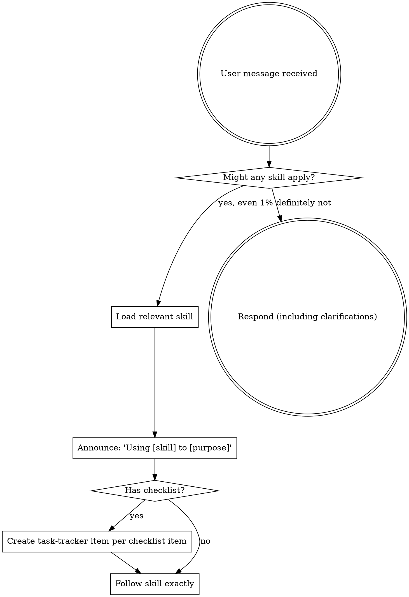

<SUBAGENT-STOP>
If you were dispatched as a subagent for a specific task (implementation, review, etc.), STOP HERE. Do not activate the skill workflow. Execute your assigned task directly.
</SUBAGENT-STOP>

<EXTREMELY-IMPORTANT>
If you think there is even a 1% chance a skill might apply to what you are doing, you ABSOLUTELY MUST invoke the skill.

IF A SKILL APPLIES TO YOUR TASK, YOU DO NOT HAVE A CHOICE. YOU MUST USE IT.

This is not negotiable. This is not optional. You cannot rationalize your way out of this.
</EXTREMELY-IMPORTANT>

## How to Access Skills

Use the current harness's native skill-loading mechanism. When a relevant skill is loaded, follow its content directly.

Harness examples:
- Claude Code: use the `Skill` tool.
- Codex: use native `~/.agents/skills/` discovery.
- Pi in this environment: read the discovered `SKILL.md` path when no dedicated skill tool is exposed.

See `references/harness-tools.md` for tool-name mappings across harnesses.

# Using Skills

## The Rule

**Invoke relevant or requested skills BEFORE any response or action.** Even a 1% chance a skill might apply means that you should invoke the skill to check. If an invoked skill turns out to be wrong for the situation, you don't need to use it.

## Red Flags

These thoughts mean STOP—you're rationalizing:

| Thought | Reality |
|---------|---------|
| "This is just a simple question" | Questions are tasks. Check for skills. |
| "I need more context first" | Skill check comes BEFORE clarifying questions. |
| "Let me explore the codebase first" | Skills tell you HOW to explore. Check first. |
| "I can check git/files quickly" | Files lack conversation context. Check for skills. |
| "Let me gather information first" | Skills tell you HOW to gather information. |
| "This doesn't need a formal skill" | If a skill exists, use it. |
| "I remember this skill" | Skills evolve. Invoke current version. |
| "This doesn't count as a task" | Action = task. Check for skills. |
| "The skill is overkill" | Simple things become complex. Use it. |
| "I'll just do this one thing first" | Check BEFORE doing anything. |
| "This feels productive" | Undisciplined action wastes time. Skills prevent this. |
| "I know what that means" | Knowing the concept ≠ using the skill. Invoke it. |

## Skill Priority

When multiple skills could apply, use this order:

1. **Process skills first** (brainstorming, debugging) - these determine HOW to approach the task
2. **Implementation skills second** (frontend-design, mcp-builder) - these guide execution

"Let's build X" → brainstorming first, then implementation skills.
"Fix this bug" → debugging first, then domain-specific skills.

## Skill Types

**Rigid** (TDD, debugging): Follow exactly. Don't adapt away discipline.

**Flexible** (patterns): Adapt principles to context.

The skill itself tells you which.

## Skills with Checklists

If a skill has a checklist, YOU MUST track EACH item using the current harness's task tracker. If the harness exposes no task-tracking tool, keep an explicit visible checklist and update it as work progresses.

**Don't:**
- Work through checklist mentally
- Skip tracking "to save time"
- Batch multiple items into one item
- Mark complete without doing them

**Why:** Checklists without visible tracking = steps get skipped. Every time.

## User Instructions

Instructions say WHAT, not HOW. "Add X" or "Fix Y" doesn't mean skip workflows.

**Red flags:** "Instruction was specific" • "Seems simple" • "Workflow is overkill"

Specific instructions = clear requirements = workflows matter MOST.
